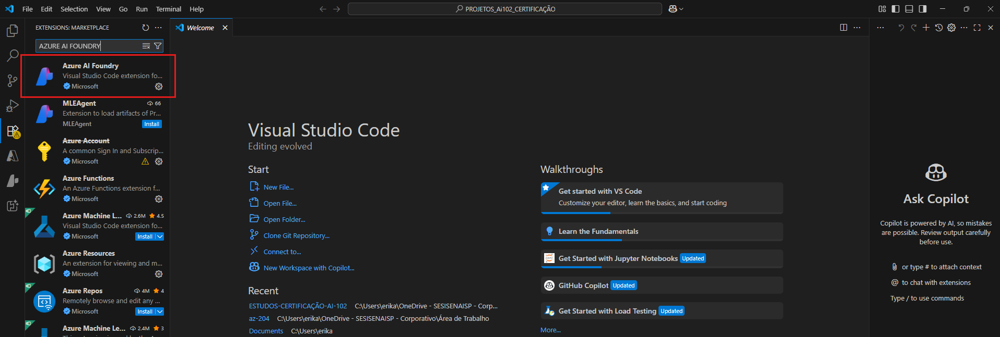
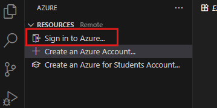
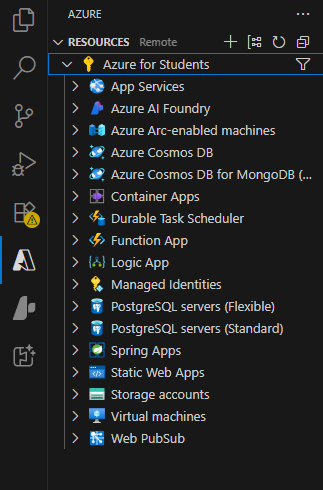
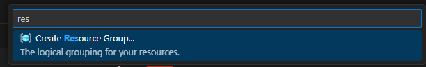
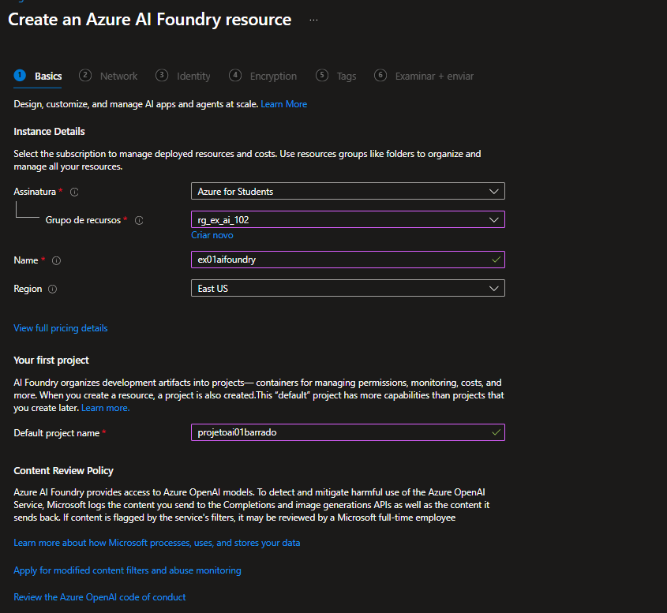
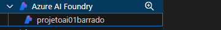
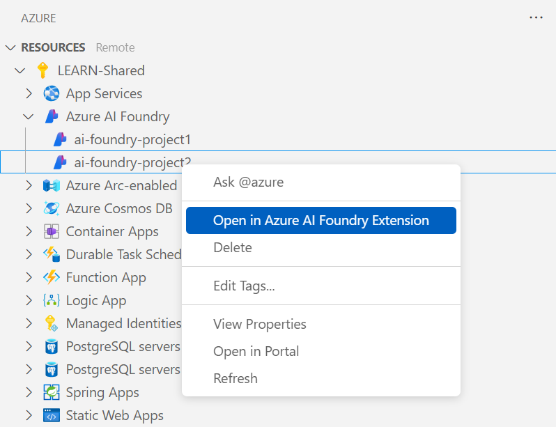
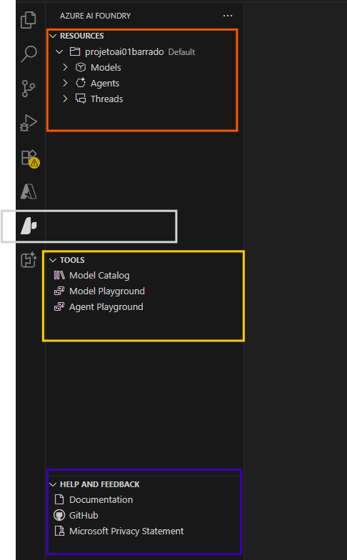

# Ferramentas e desenvolvedor e SDKs

O portal do Azure Ai Foundry, deixa executar várias tarefas para desenvolver uma solução de IA, você pode escrever, testar e implantar código

## Extensão do Azure AO Foundry para Visual Studio Code

Você pode usar a extensão Azure AI Foundry para Visual Studio Code.
Fluxo:
- Criando um projeto
- Selecionando e implantando um modelo
- testando um modelo no playground
- Criando um agente

## Instalação

Após baixar o Visual Studio Code, instale a extensão do Azure AI Foundry para Visual Studio Code.

1. Abra o Visual Studio Code.

2. Selecione Extensões no painel esquerdo.

3. Selecione o ícone Configurações no canto superior direito do painel de extensões.

4. Pesquise e selecione Azure AI Foundry.

5. Selecione Instalar.

6. Verifique se a extensão foi instalada com êxito pelas mensagens de status.

## Criando um recursos Ai Foundry

- No VS Code, acesse  Ícone do Azure na Barra de Navegação do VS Code
- Acesse o item Sign in to Azure

- Na seção de **recursos**, crie um grupo de recursos.

- Acesse o Portal do Azure e Crie um recurso de Azure AI Foundry

- Selecione **Azure AI Foundry** e clique com botão do mouse no projeto

- Selecione **Abrir na Extensão do Azure AI Foundry**.

## Explorar a extensão do Azure AOi Foundry

Abrirá o mode de exibição, com o ícone do AI Foundry de IA do Azure.
Existe três seções principais:

- Recursos
- Ferramentas
- Ajuda e Comentários

### Recursos:

Contém os recursos para acesso ao seu projeto do Azure AI Foundry. Principal área para interagir com Serviços de IA Foundry do Azure.
- Modelos: contém os modelos que pode ser utilizado para criar e implantar seus aplicativos de IA
- Agentes: contém agentes implantados em seu proneto do Azure AI Foundry
- Threads: contém os threds e é executada de um agente implantado em seu projeto do Azure Ai Foundry

### Ferramentas:

Contém as ferramentas que pode ser utilizada para criar e implantar seus aplicativos de IA. Encontra as ferramentas disponíveis para implantar e, em segudida, trabalhar com seus modelos e agentes implantados

- Catálogos de Modelos: o link para o catálogo de modelos que você pode usar para descobrir e implantar modelos
- MOdel Playground: link para o playground de modelos para interagir com seus modelos implantados em seu projeto do Azure AI Foundry
- Agent Playground: link para o playground do agente para interagir com seus agentes implantados em seu projeto do Azure AI Foundry

### Ajuda e Comentários: 

Contém links para a documentação do Azure AI Foundry, comentários, suporte e a Política de Privacidade da Microsoft

# Referências

- [Trabalhar com a extensão do Azure AI Foundry para Visual Studio Code (versão prévia)](https://learn.microsoft.com/pt-br/azure/ai-foundry/how-to/develop/get-started-projects-vs-code)