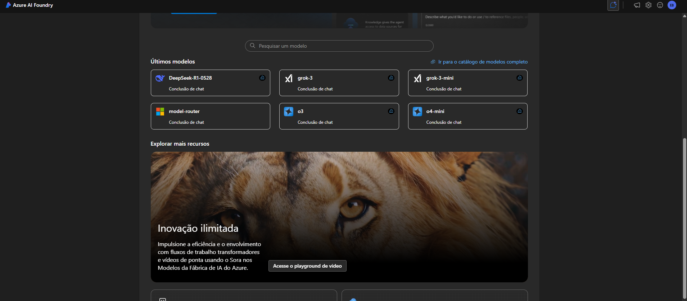
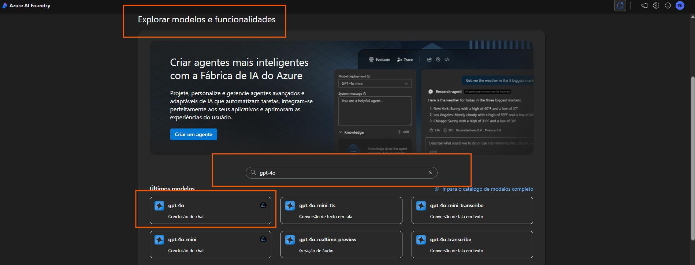
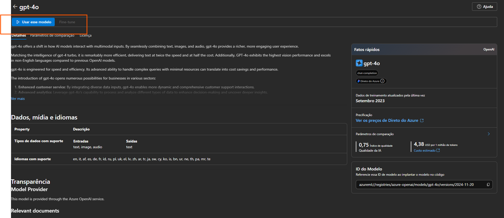
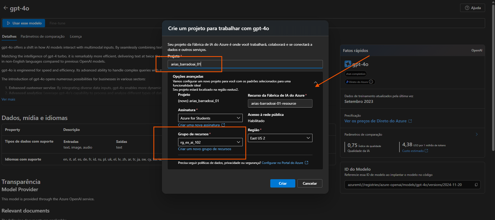
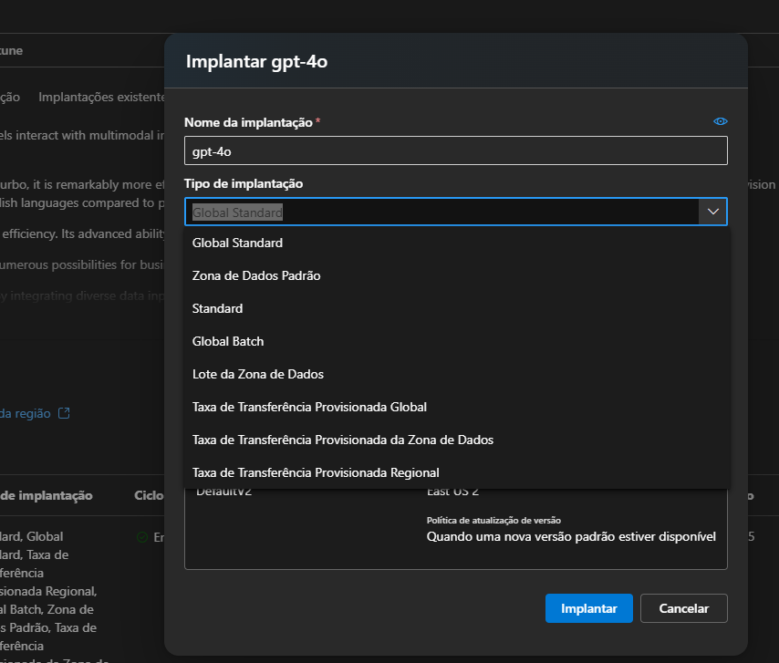
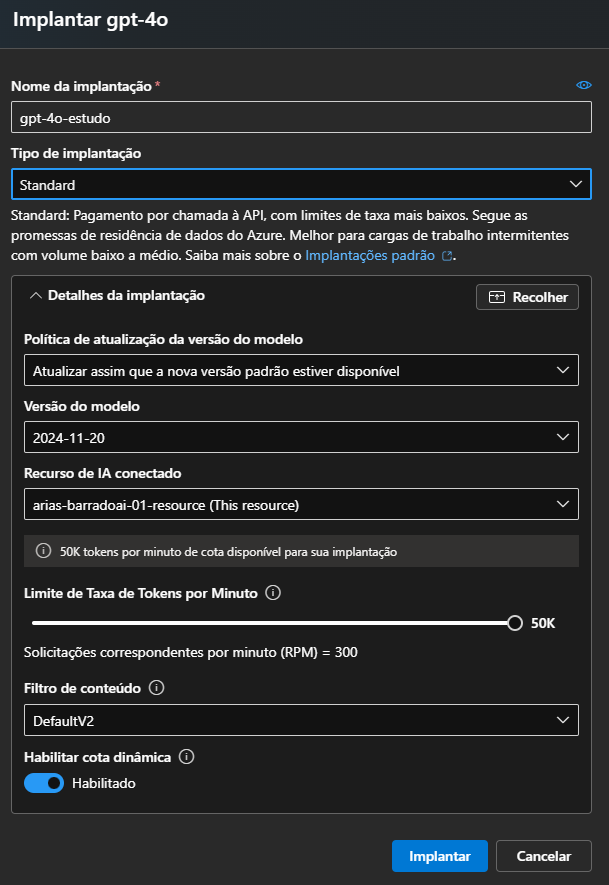
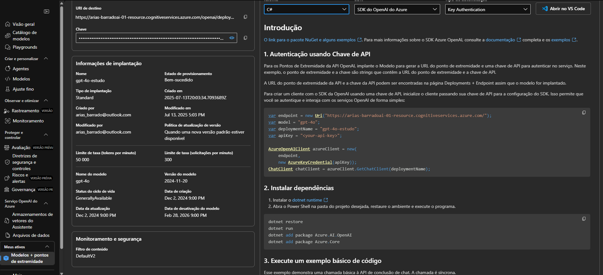
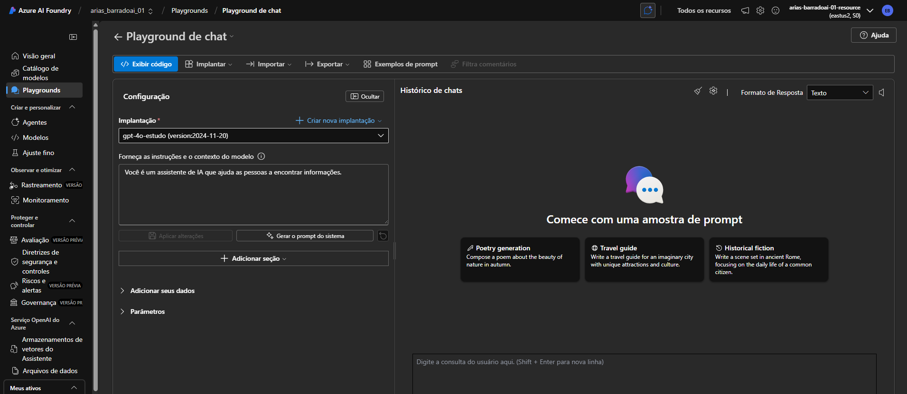
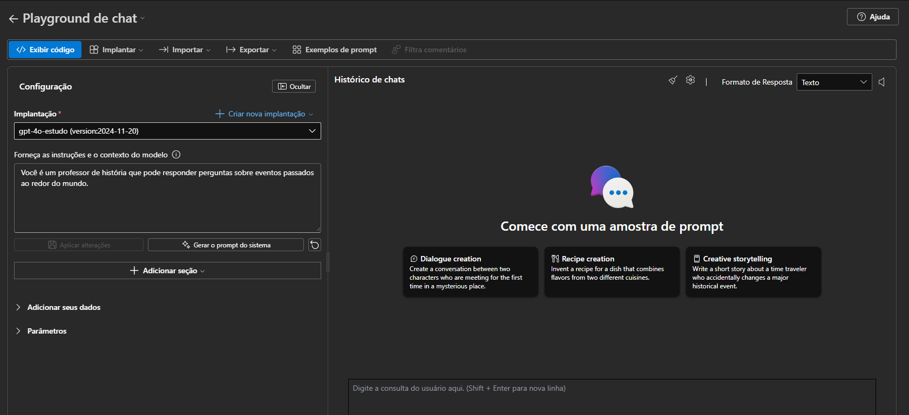
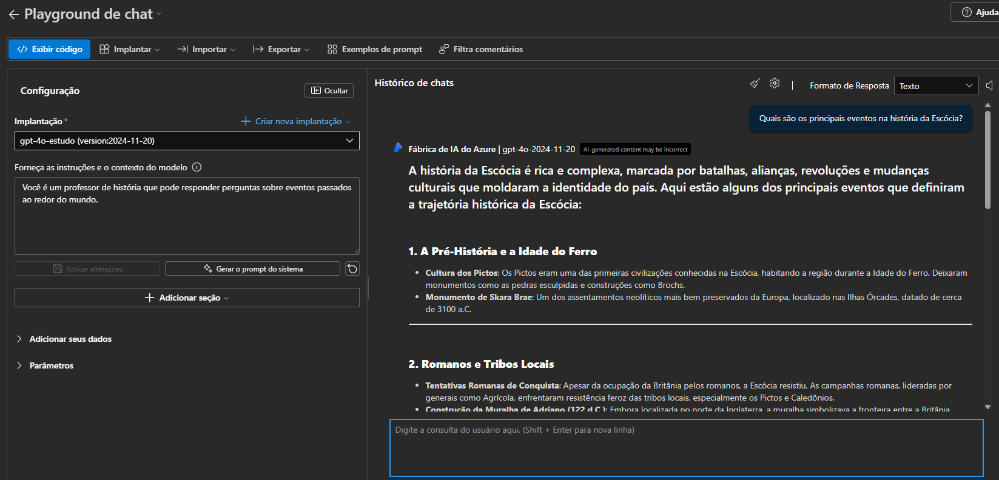

# Utilizando Portal do Azure AI Foundry

Utilizaremos o portal do Azure AI Foundry para criar um projeto.

1. Abra o [portal do Azure Ai Foundry](https://ai.azure.com)



## Criar projeto

Primeiro precisamos escolher um modelo para trabalhar e criar um projeto para usá-lo.

- Na seção **Explorar modelos e recursos** procure o **gpt-4o**.



- Nos resultados da pesquisa, selecione o modelo gpt-4o para ver seus detalhes e, na parte superior da página do modelo, selecione Usar este modelo .



- Insira um nome válido para seu projeto e expanda Opções avançadas .

    - Recurso do Azure AI Foundry : um nome válido para seu recurso do Azure AI Foundry
    - Assinatura : Sua assinatura do Azure
    - Grupo de recursos : crie ou selecione um grupo de recursos
    - Região : Selecione qualquer local com suporte aos Serviços de IA *

    

- Clique em **Criar** e aguarde a criação do projeto

- Ecolha um nome para a implantação e um tipo de implantação



### Localização e Latência

Global Standard / Global Batch / Taxa Global: ideal para uso global, com menor latência entre regiões.

Zona de Dados / Regional: adequado para conformidade com legislações de soberania de dados (ex: LGPD, GDPR) ou para menor latência dentro de uma região específica.

### Custo

Os preços variam conforme o tipo:

Standard: cobrança sob demanda, ideal para uso leve ou inicial.

Batch (Lote): mais barato, mas com maior latência, ideal para cargas em lote ou tarefas programadas.

Provisionada: aloca recursos fixos, mais caro, porém entrega desempenho garantido.

### Desempenho e Escalabilidade

Provisionadas (Transferência Provisionada): garante largura de banda e throughput, ideal para aplicações críticas ou com alta demanda.

Standard / Batch: sujeitos à concorrência com outros usuários, podendo variar em desempenho.

### Requisitos de Conformidade

Se seu projeto precisa:

Armazenar ou processar dados em uma região específica,

Cumprir leis locais de proteção de dados,
→ Você deve escolher opções com "Zona de Dados" ou "Provisionada Regional".

| Tipo de Implantação                                 | Latência | Custo | Ideal para...                                              |
|-----------------------------------------------------|----------|--------|-------------------------------------------------------------|
| **Global Standard**                                 | Média    | $      | Apps web globais, protótipos                               |
| **Standard**                                        | Média    | $      | Uso geral com custo controlado                             |
| **Zona de Dados Padrão**                            | Baixa    | $$     | Apps locais com foco em performance/região                 |
| **Global Batch / Lote da Zona de Dados**            | Alta     | $      | Processamento em lote, menor custo                         |
| **Provisionada (Global / Regional / Zona de Dados)**| Baixa    | $$$    | Alto volume, missão crítica, SLA garantido                 |




| Tipo                | Vantagem para Estudo                                                                                    |
| ------------------- | ------------------------------------------------------------------------------------------------------- |
| **Standard**        | Mais simples e econômico, sem necessidade de provisionamento. Ideal para testes ocasionais ou uso leve. |
| **Global Standard** | Similar ao Standard, mas otimizado para uso global. Também funciona bem para estudo.                    |


- Após criar o projeto o playgroud de bate-papo será aberto automativamente para que você possa testar seu modelo.



- Clique em **Playgrounds** - **Playground de chat**



- Na parte inferior do painel de navegação, à esquerda, selecione Central de gerenciamento . A central de gerenciamento é onde você pode definir as configurações nos níveis de recurso e projeto , ambos exibidos no painel de navegação

## Testar o modelo

- No painel de navegação à esquerda do seu projeto, selecione Playgrounds
- Abra o playground de bate-papo e certifique-se de que a implantação do modelo gpt-4o esteja selecionada na seção Implantação .
- No painel Configuração , na caixa Fornecer instruções e contexto ao modelo , insira as seguintes instruções:

````
Você é um professor de história que pode responder perguntas sobre eventos passados ao redor do mundo.
````


- Aplique as alterações para atualizar a mensagem do sistema.

- Na janela de bate-papo, insira uma consulta como ````Quais são os principais eventos na história da Escócia?```` e veja a resposta:



