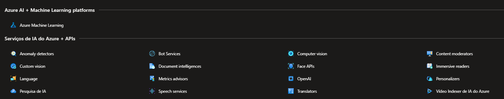
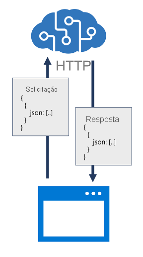

# Criar e consumir os serviços de IA do Azure

Os serviços de IA incluem uma ampla gama de serviços individuais em linguagem: **fala, visão, Ia generativa**.
Alguns serviços individuais de IA do Azure icluiem:

- **Visão de IA do Azure** – Analise conteúdo em imagens e vídeos.
- **Linguagem de IA do Azure – Crie aplicativos com recursos de compreensão de linguagem natural líderes do setor.
- **Fala de IA do Azure**– Conversão de fala em texto, conversão de texto em fala, tradução e reconhecimento de locutor.
- **IA do Azure para Informação de Documentos**: uma solução de reconhecimento óptico de caracteres (OCR) que pode extrair um significado semântico de formulários, como faturas, recibos e outros.
- **Pesquisa de IA do Azure** – Uma solução de pesquisa em escala de nuvem que usa serviços de IA para extrair insights de dados e documentos.
- **Azure AI Foundry** – um serviço de IA do Azure que fornece acesso a modelos e agentes de IA geradores.

## Recurso de vários serviços

Podemos provisionar um recurso de serviços de IA que dá suporte a vários serviços de IA diferentes

### Recurso de serviço único
#
Cada serviço de IA pode ser provisionado individualmente.

### Usar uma API REST
#

Na maioria dos casos, as funções de serviço podem ser chamadas enviando dados no formato JSON por meio de uma solicitação HTTP, que pode ser uma solicitação POST, PUT ou GET, dependendo da função específica que está sendo chamada. 

"O uso de interfaces REST com um ponto de extremidade HTTP significa que qualquer linguagem de programação ou ferramenta capaz de enviar e receber JSON por HTTP pode ser usada para consumir serviços de IA. Você pode usar linguagens de programação comuns, como Microsoft C#, Python e JavaScript; bem como utilitários como Postman e cURL, que podem ser úteis para testes.

